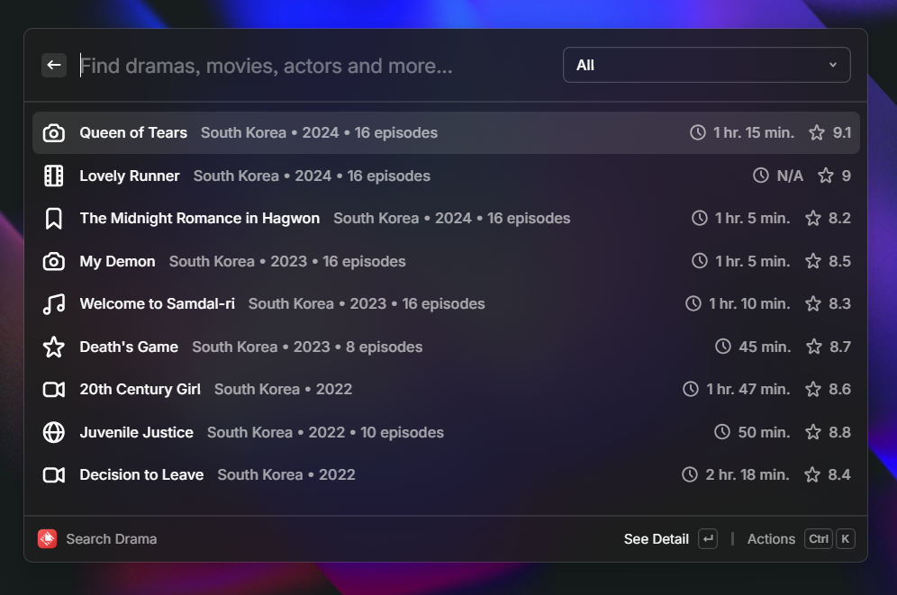
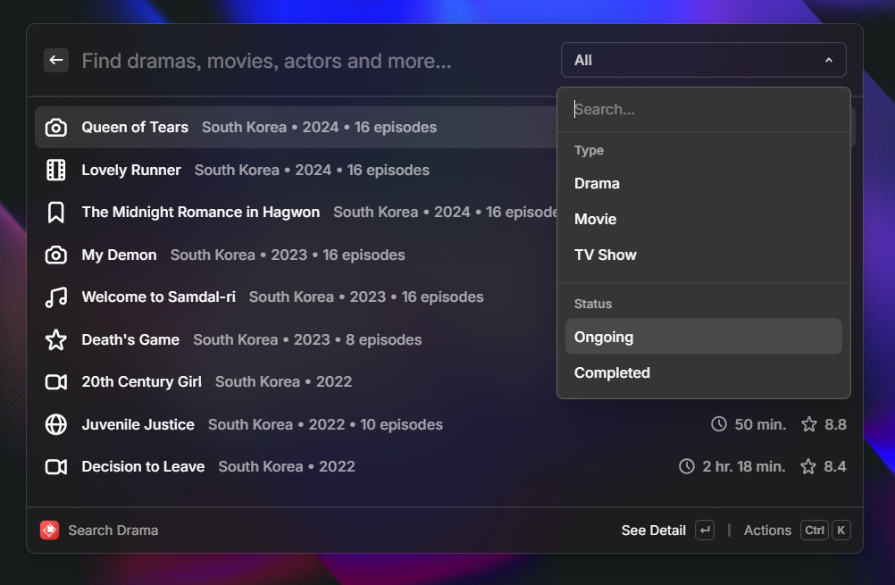
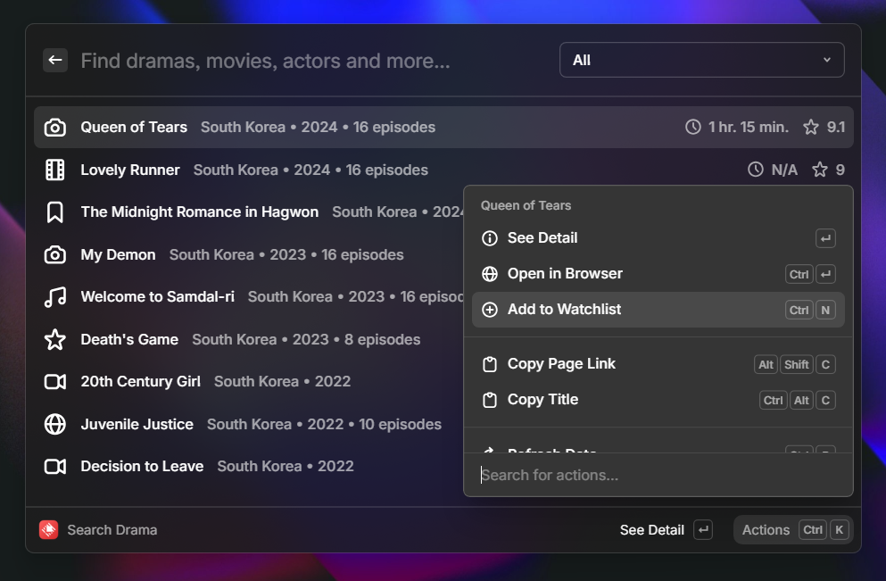
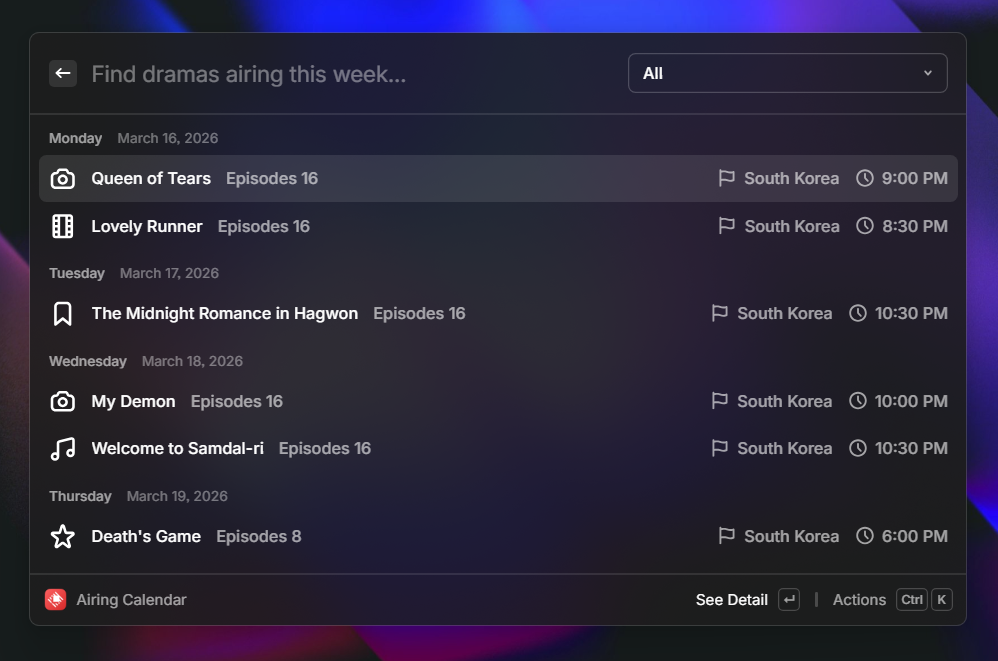
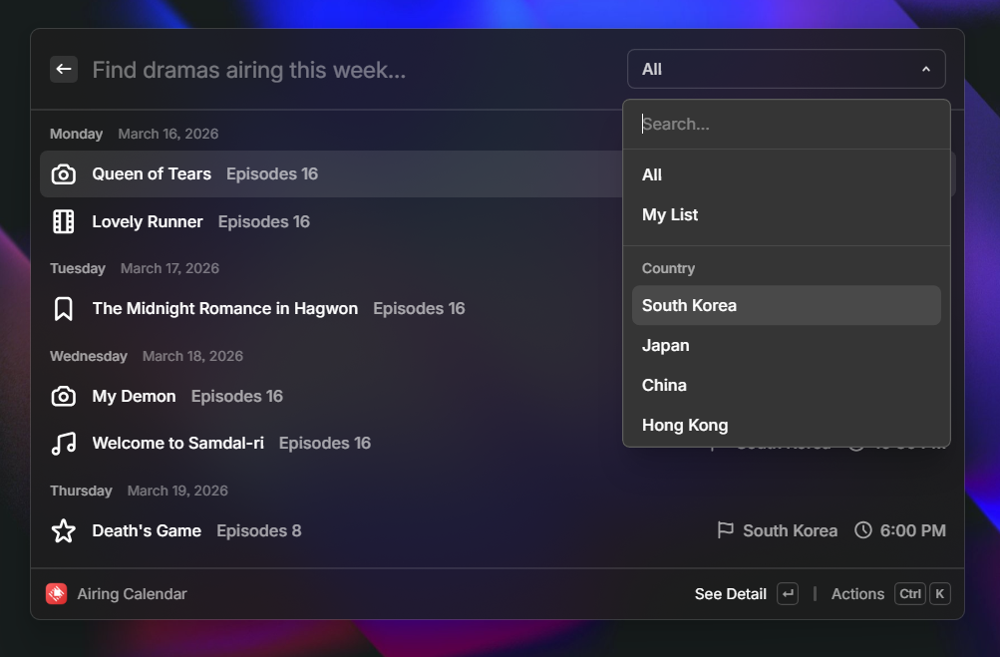
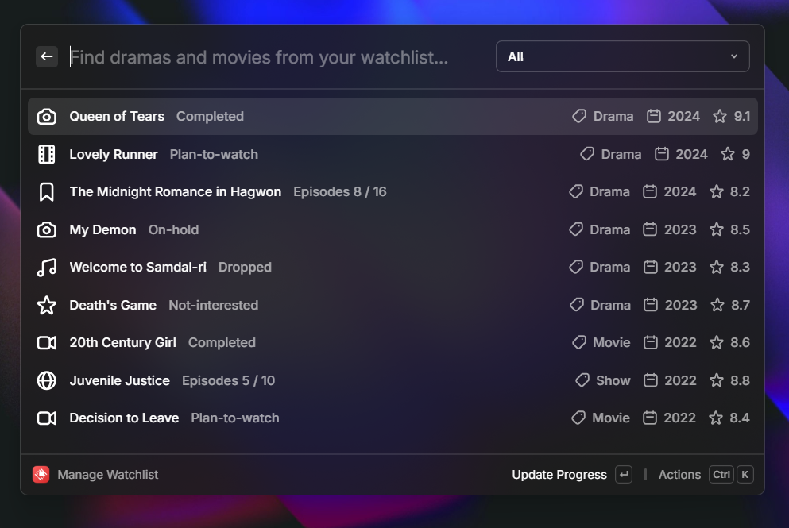
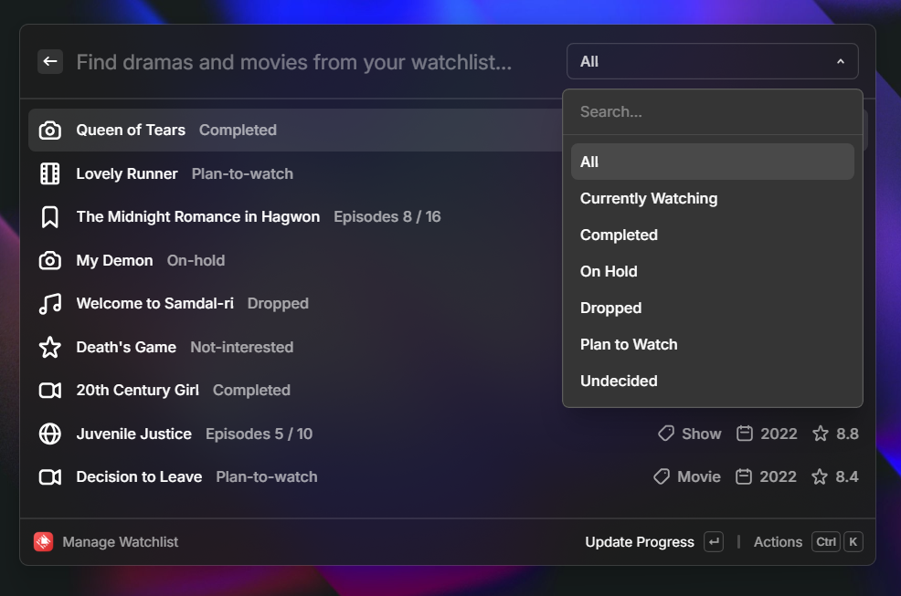
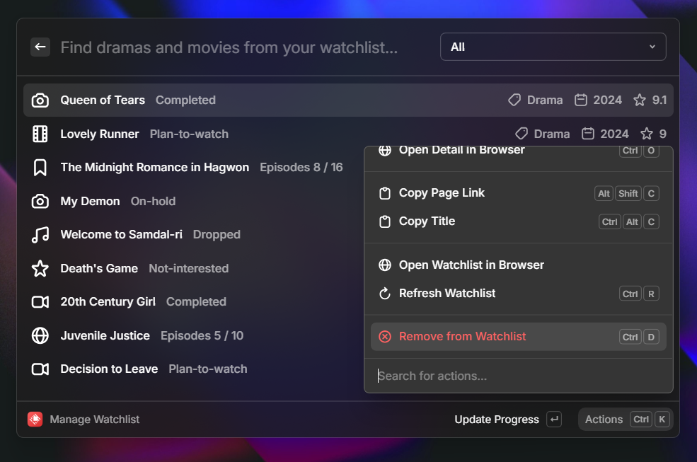

# MyDramaList for Raycast

A [Raycast](https://raycast.com) extension that brings [MyDramaList](https://mydramalist.com) directly into your workflow. Search for dramas, movies, and TV shows, track your weekly airing schedule, and manage your personal watchlist — all without leaving your keyboard.

## Commands

**Search Drama** — Search the MyDramaList catalogue. Filter by type (Drama, Movie, TV Show) or status (Ongoing, Completed, Upcoming), open detail pages, add titles to your watchlist, or copy links straight from the results.

**Airing Calendar** — View dramas airing this week, grouped by day with air times. Filter by country to focus on the region you follow most.

**Manage Watchlist** — Browse and manage everything in your watchlist. Filter by watch status (Watching, Completed, On Hold, etc.), update episode progress, and remove titles you no longer want to track.

## Screenshots

### Search Drama

### Airing Calendar

### Manage Watchlist

