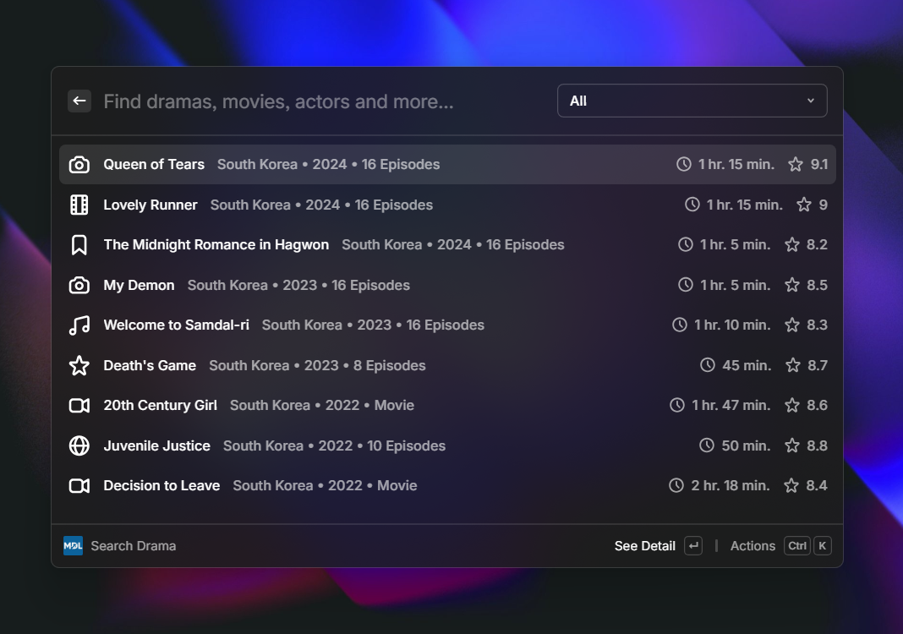

  

## MyDramaList

_Search dramas or movies, view airing calendar, and manage your drama watchlist easily in Raycast_

## Commands

### Search Drama

Search MyDramaList catalogue. Filter by type (Drama, Movie, TV Show) or status (Ongoing, Completed, Upcoming), open detail pages, add titles to your watchlist, or copy links straight from the results.

### Airing Calendar

View dramas airing this week, grouped by day with air times. Filter by country to focus on the region you follow most.

### Manage Watchlist

Browse and manage everything in your watchlist. Filter by watch status (Watching, Completed, On Hold, etc.), update episode progress, and remove titles you no longer want to track.

 

Check preview at [`/assets/preview`](/assets/preview/)
